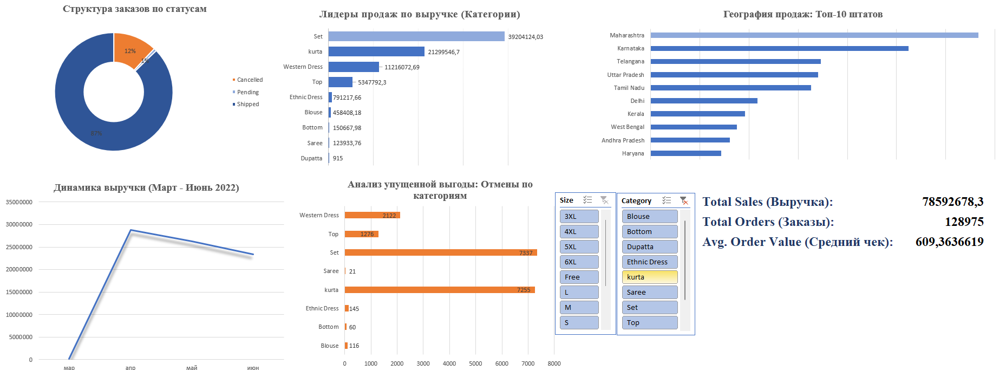

# Анализ продаж Amazon: Интерактивный дашборд в Excel

## Обзор проекта
В рамках данного проекта я провела полный цикл анализа данных о продажах Amazon (период: март - июнь 2022 г.). Целью было превратить массив «сырых» данных в наглядный бизнес-отчет для оценки эффективности продаж, выявления лидеров рынка и анализа операционных проблем (отмен заказов).

## Что было сделано (Hard Skills)
* **Очистка данных (Data Cleaning)**: Работа с пропущенными значениями в колонке `Amount`, нормализация названий категорий и форматов дат.
* **Сводные таблицы (Pivot Tables)**: Обработка более 120 000 строк данных для расчета ключевых показателей.
* **Визуализация (Data Viz)**: Создание профессионального дашборда с использованием сводных диаграмм.
* **Интерактивность**: Настройка срезов (Slicers) по категориям и размерам для мгновенной фильтрации данных.
* **Дизайн**: Применение единой цветовой кодировки (темно-синий для успешных заказов, оранжевый — для отмен) для быстрого считывания инсайтов.

## Ключевые бизнес-инсайты
* **Лидеры выручки**: Категории "Set" и "kurta" приносят основной доход (общая выручка составила более 78.5 млн).
* **Проблема отмен**: Средний уровень отмен составляет около 12%. Заметно, что самые продаваемые категории также имеют самый высокий объем отмен, что может указывать на проблемы с размерной сеткой или качеством товара в этих сегментах.
* **География**: Штат Maharashtra является абсолютным лидером по объему продаж, значительно опережая другие регионы.
* **Средний чек**: Рассчитан показатель Avg. Order Value, который составил примерно 609.3.

## Визуализация дашборда

## Структура репозитория
* `Amazon_Sale_Report.xlsx`: Итоговый файл Excel с дашбордом и расчетами.
* `images/`: Скриншоты процесса работы и финального результата.
